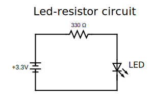
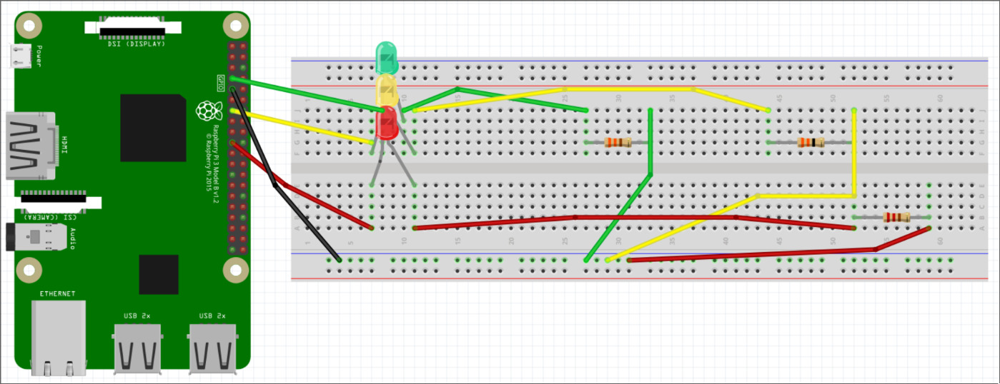
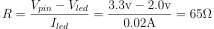
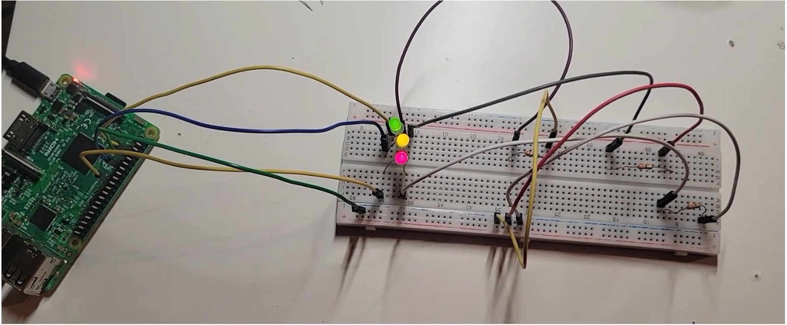
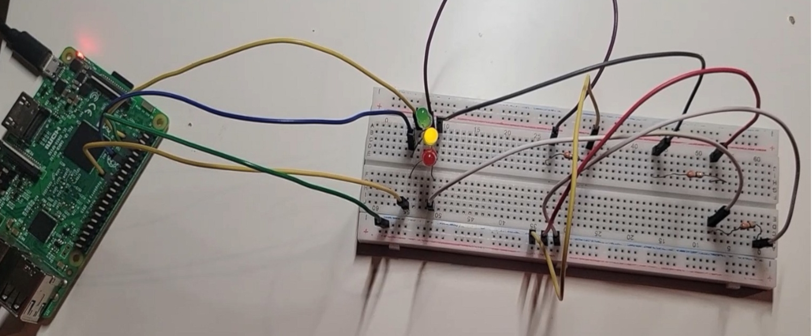

# P1-IntroRPi_24-25
# Proyecto: Semáforo con LEDs 

Este proyecto tiene como objetivo recrear un semáforo utilizando LEDs controlados por una Raspberry Pi 3B+.  
Para ello vamos a emplear tres LEDs (verde, amarillo y rojo) y asignar a cada uno un pin único.  
Permitiendo controlar cada LED de manera independiente para simular el comportamiento de un semáforo.

## Materiales

- 3 LEDs (verde, amarillo y rojo)
- 3 resistencias de 330 Ω (ohmios)
- Breadboard
- Raspberry Pi 3B+

## Circuito Eléctrico

Para el montaje del circuito, decidimos realizar **tres circuitos individuales**. Cada circuito está compuesto por un LED y una resistencia, lo que nos permite asignar a cada LED un pin único en la Raspberry Pi. De esta manera, podemos controlar cada LED independientemente y simular el semáforo.

### Imágenes del Circuito

## Cálculo de Resistencias

En este proyecto, utilizamos **tres resistencias de 330 ohmios** porque eran las más cercanas que teníamos disponibles. Sin embargo, teóricamente deberíamos haber usado resistencias de aproximadamente **65 ohmios** para lograr la máxima eficiencia de los LEDs. Este valor más alto de resistencia afecta la luminosidad de los LEDs, haciendo que se iluminen ligeramente menos de lo esperado.

### Fórmula de la Resistencia (Ley de Ohm)
Para calcular las resistencias teóricas, utilizamos la **Ley de Ohm**. La fórmula se basa en restar el voltaje de entrada (3.3V, que es el voltaje de los pines GPIO) menos el voltaje de funcionamiento de los LEDs. Luego, dividimos este valor entre la corriente de los LEDs. 

### Cálculo:
- **Voltaje de entrada**: 3.3V
- **Voltaje de LED**: 2V (valor promedio de los LEDs)
- **Corriente de LED**: 0.02A (20mA)

La resistencia teórica se calcula como:

  

## Prueba del Circuito

Puedes revisar el **video de prueba del circuito y del código** donde simulamos el funcionamiento del semáforo. También incluimos capturas de pantalla de diferentes momentos del video para visualizar el comportamiento del semáforo en diferentes fases.

  
  

---

Javier Gonzalez Villasmil

Miguel Giraldo Chicaiza

This project is licensed under the Creative Commons Attribution-ShareAlike 4.0 International License (CC BY-SA 4.0). You can view the full license text below or at https://creativecommons.org/licenses/by-sa/4.0/legalcode.

Nota: Este código y vídeo es para un actividad de universidad del profesor Julio Vega.
